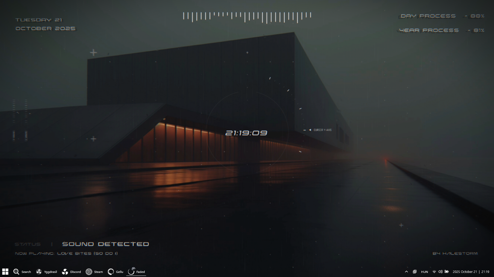
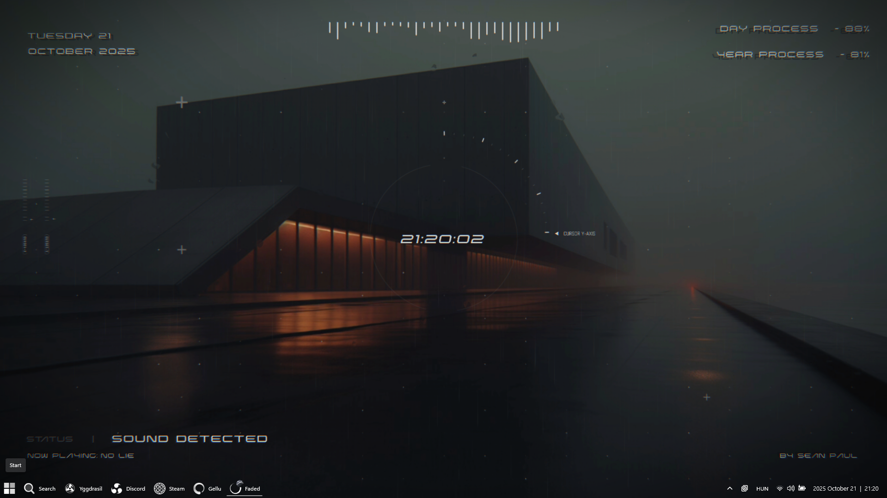
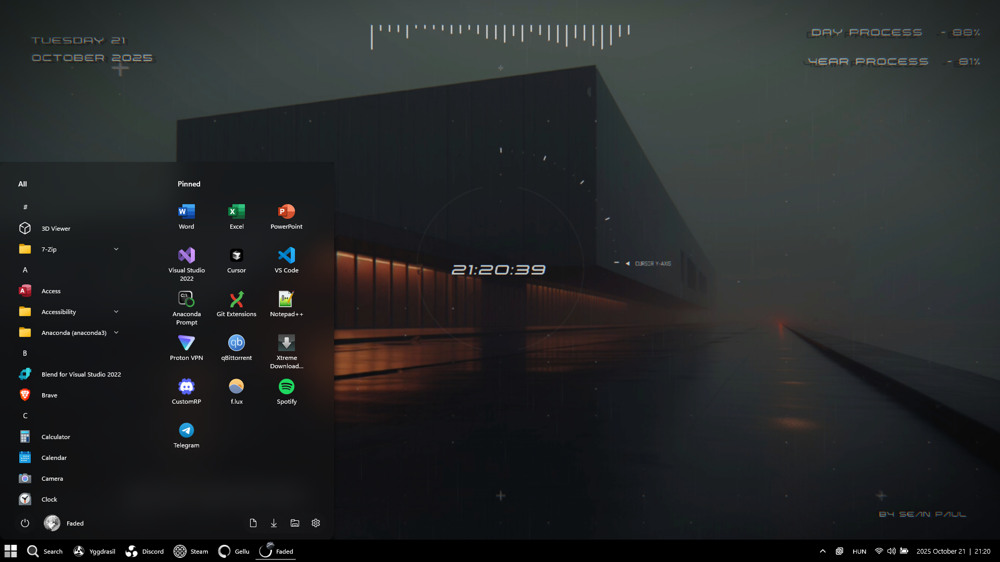

# White Start Button Taskbar Style for Windows 11

This is a custom style for the **Windows 11 Taskbar** that replaces the default **Start Button** with a white-themed version. It works with **[Windhawk’s Windows 11 Taskbar Styler](https://windhawk.net/mods/windows-11-taskbar-styler).**
The purpose of this project is to have a custom **Start Button** with **[TranslucentTB](https://translucenttb.com/)**.

## Preview








## Features

- **Custom Start Button**  
  Replaces the default Start button with your own images.

- **Pointer & Pressed States**  
  Different images for `hover`, `pressed`, and `normal` states.

- **Hides Animated Icon**  
  Collapses the default Start button animated icon.

- **Removes Extra Padding & Borders**  
  Adjusts the Start button panel for a cleaner look.

## Installation

1. **Install [Windhawk](https://windhawk.net/)**.
   Windhawk allows you to apply community mods safely to Windows 10/11.

2. **Install the [Windows 11 Start Menu Styler](https://windhawk.net/mods/windows-11-start-menu-styler)** mod inside Windhawk.

3. Place your custom Start button images in a folder and update the paths in the `.json` file: (Or use the provided images)

  ```
  ImageSource='YOUR_DRIVE\\YOUR_PATH_HERE\\StartButtonFullWhite.png'
  ```

  For example:

  ```
  ImageSource='C:\\Pictures\\Start_Menu_Icons\\StartButtonFullWhite.png'
  ```

<details>
  <summary>Click here to reveal the JSON</summary>
  
  ```json
{
	"controlStyles[0].target": "Taskbar.ExperienceToggleButton#LaunchListButton[AutomationProperties.AutomationId=StartButton] > Taskbar.TaskListButtonPanel@CommonStates > Border#BackgroundElement",
	"controlStyles[0].styles[0]": "Background@InactiveNormal:=<ImageBrush Stretch=\"None\" AlignmentY='Center' AlignmentX='Center' ImageSource='YOUR_DRIVE\\YOUR_PATH_HERE\\StartButtonFullWhite.png' />",
	"controlStyles[1].target": "Taskbar.ExperienceToggleButton#LaunchListButton[AutomationProperties.AutomationId=StartButton] > Taskbar.TaskListButtonPanel > Microsoft.UI.Xaml.Controls.AnimatedVisualPlayer#Icon",
	"controlStyles[1].styles[0]": "Visibility=Collapsed",
	"controlStyles[0].styles[1]": "Background@InactivePointerOver:=<ImageBrush Stretch=\"None\" AlignmentY='Center' AlignmentX='Center' ImageSource='YOUR_DRIVE\\YOUR_PATH_HERE\\StartButtonFullWhite_1.png' />",
	"controlStyles[0].styles[2]": "Background@InactivePressed:=<ImageBrush Stretch=\"None\" AlignmentY='Center' AlignmentX='Center' ImageSource='YOUR_DRIVE\\YOUR_PATH_HERE\\StartButtonFullWhite_2.png' />",
	"controlStyles[2].target": "Taskbar.TaskListButtonPanel#ExperienceToggleButtonRootPanel",
	"controlStyles[2].styles[0]": "Padding=0,0,0,0",
	"controlStyles[0].styles[3]": "BorderThickness=0",
	"controlStyles[0].styles[4]": "Background@ActiveNormal:=<ImageBrush Stretch=\"None\" AlignmentY='Center' AlignmentX='Center' ImageSource='YOUR_DRIVE\\YOUR_PATH_HERE\\StartButtonFullWhite_2.png' />",
	"controlStyles[0].styles[5]": "Background@ActivePointerOver:=<ImageBrush Stretch=\"None\" AlignmentY='Center' AlignmentX='Center' ImageSource='YOUR_DRIVE\\YOUR_PATH_HERE\\StartButtonFullWhite_1.png' />",
	"controlStyles[0].styles[6]": "Background@ActivePressed:=<ImageBrush Stretch=\"None\" AlignmentY='Center' AlignmentX='Center' ImageSource='YOUR_DRIVE\\YOUR_PATH_HERE\\StartButtonFullWhite_2.png' />"
}
```
  
</details>

4. Open **Windhawk**.

5. Open the **Advanced** menu.

6. Paste into **Mod Settings** the JSON that you modified.

7. Click **Save**.

8. Check if **Windows 11 Taskbar Styler** is **Enabled**.

> [!TIP]
> Customizing the **Taskbar**: Open the **Settings** menu. Under the **Theme** settings, choose **"None"** or whatever you want. Click **Save settings**
> 
> For **TranslucentTB** or other **Taskbar Modifier** programs aside from **Windhawk's Windows 11 Taskbar Styler**, it is recommended to choose **"None"** as a theme.

## File Structure

The `.json` file contains style overrides for specific taskbar elements:

| Target | Style Property | Description |
|--------|----------------|-------------|
| `Taskbar.ExperienceToggleButton#LaunchListButton > Taskbar.TaskListButtonPanel@CommonStates > Border#BackgroundElement` | `Background@InactiveNormal` | Image for Start button in inactive normal state |
|          | `Background@InactivePointerOver` | Image for inactive hover state |
|          | `Background@InactivePressed` | Image for inactive pressed state |
|          | `Background@ActiveNormal` | Image for active normal state |
|          | `Background@ActivePointerOver` | Image for active hover state |
|          | `Background@ActivePressed` | Image for active pressed state |
|          | `BorderThickness=0` | Removes the button border |
| `Taskbar.ExperienceToggleButton#LaunchListButton > Taskbar.TaskListButtonPanel > Microsoft.UI.Xaml.Controls.AnimatedVisualPlayer#Icon` | `Visibility=Collapsed` | Hides the animated Start icon |
| `Taskbar.TaskListButtonPanel#ExperienceToggleButtonRootPanel` | `Padding=0,0,0,0` | Removes extra padding from Start button panel |

## Credits

- **[Windhawk](https://windhawk.net/)** by Ramen Software  
- **[Windows 11 Taskbar Styler](https://windhawk.net/mods/windows-11-taskbar-styler)** by Ramen Software / community contributors  
- Original concept & testing – [SandTechStuff](https://github.com/SandTechStuff)
- The comment that inspired me: [SandTechStuff's comment](https://github.com/ramensoftware/windows-11-taskbar-styling-guide/issues/153#issuecomment-2569892017)

## Notes

- Ensure that your images are sized appropriately to match the default Start button dimensions.
- Tested on Windows 11 with Windhawk. Compatibility with future Windows updates is not guaranteed.

## Issues

- Centering vertically may only work with the default taskbar height. Otherwise it may be a few pixels off.
